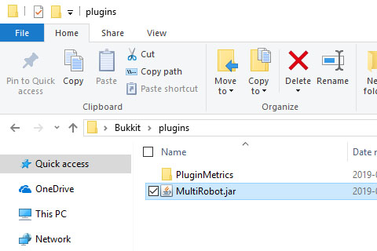

# [快速搭建](../)/机器人 - Minecraft 模式

## 特点
- 最简单的运行模式，搭建简单。
- 本运作结构针对一游戏服务器与一群互通，适合大多数的用户使用。

## 运行模式
- 我们再次看一下运行结构图，分析一下我们需要做些什么。  

- 由于黑色部分是别人已经做好了的内容，灰色部分只是红色部分的扩展用法，因而下文中我们着重讨论图中红色的部分。

## 开始搭设
- 我们以 [Bukkit](../../install/bukkit/) 与 [CoolQ](../../install/coolq/) 为例，并将其部署在同一台设备 (网络概念为“本机”) 上。
- 在这个运行结构中。 酷Q机器人端设为JustChat服务端，Minecraft服务器端设为JustChat客户端。
### 准备工作
- 下载 [Bukkit](https://bukkit.org) 与 [CoolQ Air](https://cqp.im/air) 备用。   
- `CoolQ Air` 为 CoolQ 的免费版，使用付费的 [CoolQ Pro](https://cqp.im/pro) 依然可以正常使用本插件

### 搭设 [Minecraft Bukkit 服务端](../../install/bukkit/)
1. 将jar插件文件复制到酷Q插件目录: `plugins/` 。  

1. 启动 Bukkit 服务端，生成初始配置文件。
1. 在 `plugins/MultiRobot/`  中找到配置文件并按照您的喜好修改。  
[配置文件格式介绍](../../install/bukkit/#配置文件)  
	1. `serverIP` 修改为 `127.0.0.1`
	2. `serverPort` 修改为 `38440`
	3. `serverName` 修改为 `我的水桶服务器`
	4. 记录下 `ID` 的值，备用。
1. 重启 Bukkit ，使得修改后的配置文件生效。

### 搭设 [酷Q机器人端](../../install/coolq/)
1. 将cpk插件文件复制到酷Q插件目录: `app/` 。  

1. 启动酷Q并启用本插件，生成初始配置文件。  

1. 关闭酷Q。
1. 在 `data/app/com.superexercisebook.justchat/` 或 `app/com.superexercisebook.justchat/` 中找到配置文件并按照您的喜好修改。  
[配置文件格式介绍](../../install/coolq/#配置文件)  
	1. `connection.server.enable` 修改为 `true`。 
	1. `connection.server.port` 修改为 `38440`。
	1. `connection.name` 修改为 '我的酷Q机器人'。
	1. `services[0].bind.qqgroups[0]` 修改为你的QQ群群号。
	1. `services[0].bind.minecraft[0]` 修改为你刚刚记录的 `ID` 值。
	1. 假设QQ群号是 `1234567890`, 最后的配置文件如下。
	```
	{
		............
		"connection": {
			"server": {
				"enable": true,
				"port": 38440
			},
		............
			"ID": "我的酷Q机器人",
			"name": "xxxxxxxx-xxxx-xxxx-xxxx-xxxxxxxxxxxx"
		},
		"services": [
			{
				"bind": {
					"qqgroups": [
						1234567890
					],
					"minecraft": [
						"刚刚记录下来的ID"
					]
				}
			}
		],
		............
	}
	```
1. 启动 酷Q ，使得修改后的配置文件生效。

### 搭设完成
- 开始享受愉快的聊天之旅吧~